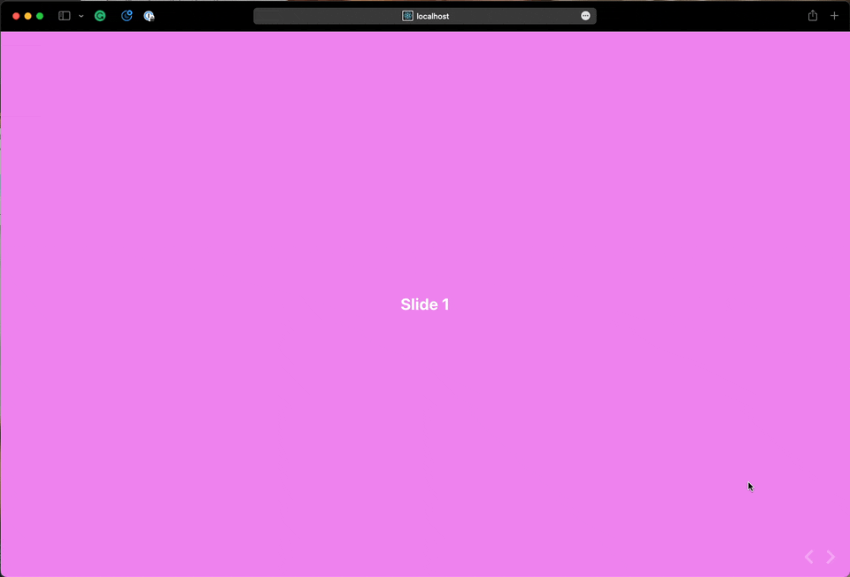

# React Presentable

React Presentable is a lightweight zero-dependency module to create slideshows inside React. The slides can render whatever react code you like.

Use the arrow keys or left mouse button to navigate between slides.



## Installation

```sh
npm install --save react-presentable
```

## Usage

```js
import Presentation, { Slide } from 'react-presentable'

// ...

return (
  <Presentation
    style={{ width: '100vw', height: '100vh' }}
    theme={{ backgroundColor: 'violet', textColor: '#fff' }}
  >
    <Slide>
      <h1>Slide 1</h1>
    </Slide>
    <Slide>
      <h1>Slide 2</h1>
    </Slide>
  </Presentation>
)
```

## Props

### `children`

- optional
- type: `ReactNode`

The slides in the presentation.

### `style`

- optional
- type: `CSSProperties`

Override styling of the presentation.

### `theme`

- optional
- type: `PresentationTheme`

The theme of your presentation.
backgroundColor?: string
textColor?: string

### `showProgressBar`

- optional
- type: `boolean`
- default: `true`

Display a animated progress bar or not.

### `className`

- optional
- type: `CSSProperties`

The CSS class of the presentation element
